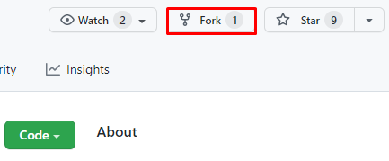
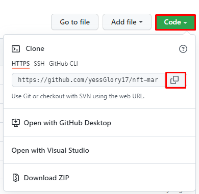

# Welcome to the NFT MarketPlace Contribution guide

Thank you for investing your time in contributing to our project!

## Setting up your environment

1. Install [Node.js and npm](https://nodejs.org).
2. Install [Git CLI](https://git-scm.com/).
3. Install any code editor you prefer (e.g. [Visual Studio Code (VS Code)](https://code.visualstudio.com/)).

## Getting Started

1. Fork this repository by clicking on the fork button on the top of this page. This will create a copy of this repository in your account.

2. Now clone the forked repository to your PC by running the following command in you terminale. (Don't forget to put your own github username between instead of `{{YOUR GITHUB USERNAME}}`).
&nbsp; `git clone https://github.com/{{YOUR GITHUB USERNAME}}/nft-marketplace.git`

3. Open the project folder or run this command `cd nft-marketplace` to change current working directory.

4. Now run `npm install` to install all the dependencies that the project needs.

5. You can also run `npm start` to run the project on a local server.

6. You can now start contributing to the project.

### Upload your contributions online

You can commit to your repository every time you make a change to the code and then make a pull request to push all the changes to this original repository.

#### Every time you make a change

1. Run `git add .` to make git track your changes to all the files in the repository.

2. Run `git commit -m "Message"` to commit and save a checkpoint to the last changes you have made (make sure to write a descriptive message to your changes).

3. Run `git push origin main` to push the changes to your forked repository.

#### Once ready with your contribution

Go to your forked repository on Github, enter the `pull requests` tab and click on the `New pull request` button and give your pull request a descriptive title.

